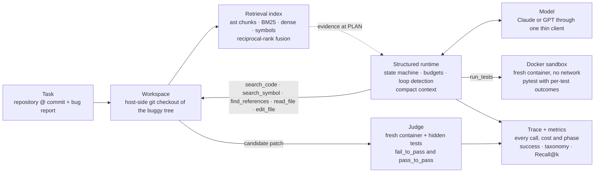
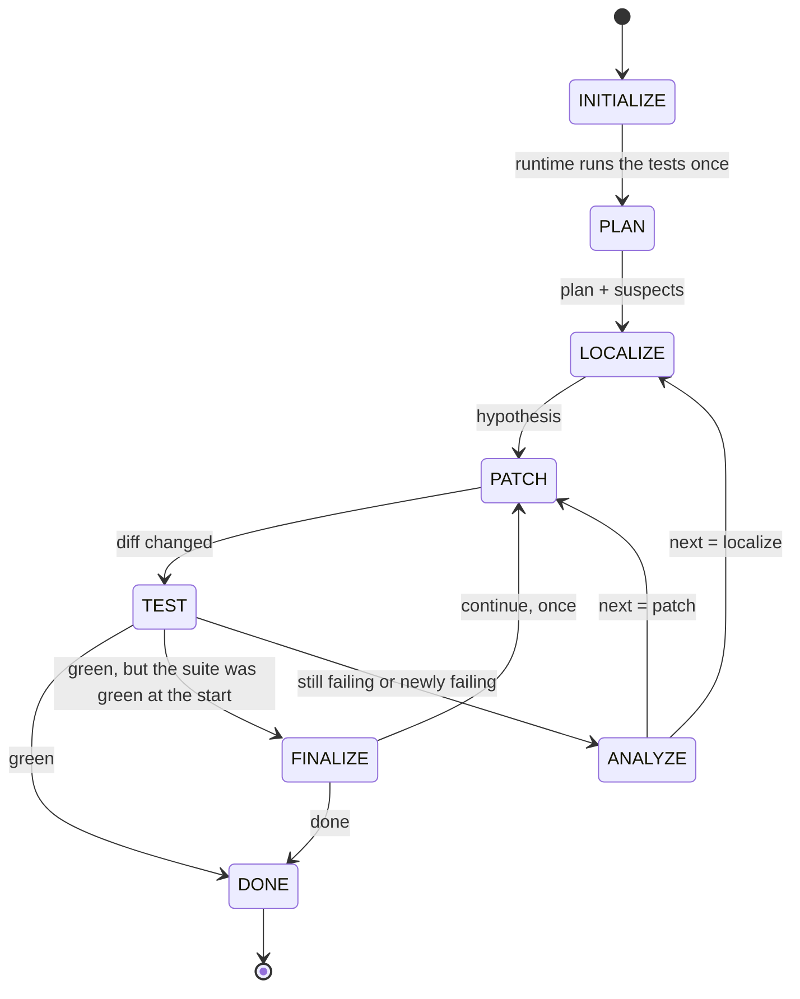

# RepoPilot

[](https://github.com/Marco-C-VBH/RepoPilot/actions/workflows/ci.yml)
Python 3.11+ · MIT

An evaluation-driven repository debugging agent for Python. Given a Git
repository and a bug report, RepoPilot searches the codebase, reads the
relevant code, writes a patch, validates it with pytest inside an isolated
Docker sandbox, and iterates on failures under a fixed step / token / cost /
runtime budget — recording a structured trace of everything it did.

The point is not the LLM call. The point is measurement: task success on a
deterministic benchmark, retrieval recall, cost, latency, and a failure
taxonomy, with every feature justified by a pre-registered experiment and
every number below traceable to an archived run in `evals/experiments/`.
Where an expectation missed, the miss is reported next to it.

## Results

RepoPilot-Bench v1 is 50 reproducible debugging tasks on seven pinned
Python repositories: the 14 tasks of v0 (cachetools, toolz, tenacity) plus
36 new ones on click 8.3.0, rich 14.1.0, jinja 3.1.6 and sqlparse 0.5.3 —
eight controlled mutations and one historical fix per repository, every bug
report audited so that it never names the changed symbol or file, 25 of the
36 caught only by a hidden test, 28 with the symptom in a different module
than the cause ([the benchmark](#repopilot-bench-v1)). Every configuration
runs under the same budget (30 steps, 40 tool calls, 5 test runs, 100k
tokens, $0.50, 600 s per task). Runs of 2026-09-26/28; the archive is named
in the last column.

| | | archive |
| --- | --- | --- |
| Benchmark | 50 tasks, 7 repositories, 46 mutations + 4 historical fixes; null solver 0 / 50, reference fixes 100 / 100 over two repeats | `bench-v1-null`, `bench-v1-gold-x2` |
| Task success, 36 new tasks | `claude-sonnet-5` baseline **86.1 %** · `gpt-5.6-luna` baseline **86.1 %** · `claude-haiku-4-5` structured runtime **70.8 %** · `claude-haiku-4-5` baseline **36.1 %** | [five arms](#the-five-arms-on-the-36-new-tasks) |
| Structured runtime, same model, same 100k budget | Haiku **36.1 % → 70.8 %** (+34.7 pp, 2 × 36 runs each), tokens per task 106.5k → 64.4k (**−40 %**), cost $0.114 → $0.076, runs ended by the budget 97 % → 33 % | `baseline-v1-haiku45-x2`, `structured-v1-compact-none-haiku45-x2` |
| Retrieval Recall@10 (file), 36 new tasks | **0.86** (BM25 + dense, MRR 0.57; v0: 0.93 / 0.86); the symbol channel falls from 0.93 on v0 to 0.22, because the reports no longer name symbols | `retrieval-v1` |
| Retrieval evidence injected at PLAN | **no success gain**: 68.1 % vs 70.8 % (a tie), −11 % steps, −17 % tool calls, +15 % tokens — a negative result, mechanism below | `structured-v1-compact-evidence-haiku45-x2` |
| Leak ablation (luna baseline) | success **86.1 % with the report, 5.6 % without it**; redacting the report's identifiers costs 5.5 pp; on v0 the same ablation leaves 42.9 % without the report | `leak-v1-{A,Bp,C,D}-{v1new,v0}-luna` |
| Median cost / task | $0.076 (Haiku, structured) · $0.119 (Sonnet, baseline) · $0.004 (luna, baseline) | |
| Median solve time / task | 40 s (Haiku, structured) · 28 s (Sonnet, baseline) · 23 s (luna, baseline) | |

Contents: [How it works](#how-it-works) · [Five findings](#five-findings) ·
[Results on Bench v1](#results-on-repopilot-bench-v1) ·
[The benchmark](#repopilot-bench-v1) · [Quick start](#quick-start) ·
[Design notes](#design-notes) · [Layout](#layout) · [License](#license) ·
the v0 chapter (Phases 1–3) in [`docs/results-v0.md`](docs/results-v0.md).

## How it works



The agent works on a host-side git checkout through six typed tools —
`search_code`, `search_symbol`, `find_references`, `read_file`, `edit_file`,
`run_tests` — and only `run_tests` touches the sandbox: the workspace diff
is applied to a fresh copy of the tree in a container with no network and
pytest runs there. The final diff is the candidate patch, judged in another
fresh container with the task's hidden tests applied; any edit to a test
file is stripped before judging. Every model call and tool call, with
tokens, latency, cost, arguments and result, goes to a JSONL trace, and
`summary.json` turns a run into success, cost and latency metrics, a
failure taxonomy and breakdowns by task property.

### The runtime state machine

`--solver structured` runs the same tools, workspace, sandbox, budget and
model through a state machine that owns control; `--solver baseline` is the
plain tool-calling loop it is measured against.



INITIALIZE and TEST belong to the runtime, the other phases to the model.
INITIALIZE runs the task's test command once, before any change, so the
initial failures are known; PLAN, ANALYZE and FINALIZE are single JSON
calls without tools; LOCALIZE may search and read (10 calls per visit,
then the runtime asks for the hypothesis — a reply without tool calls);
PATCH may also edit (4 edits per visit) and never runs tests — a patching
turn that ends with a changed diff hands over to TEST, which runs the full
command and classifies every test as fixed, still failing or newly
failing; ANALYZE decides where to go next and whether to keep the patch
(`keep_patch = false` resets the tree); FINALIZE exists for hidden-only
tasks, whose visible suite is green from the start. What the runtime does
that the baseline leaves to the model: it reproduces before planning,
verifies after every patching turn, and ends the run on a green full-suite
run — no exploring after success; it refuses tools outside the phase; it
refuses the third identical tool call the model can still see (same
arguments, same workspace version) with a replanning notice and ends the
run as `agent_loop` if the call comes back with that notice in view; it
nudges once when a patching turn ends without an edit and ends the run as
`no_progress` on the second; it reverts the workspace when ANALYZE says so.
`max_test_runs = 5` means one reproduction plus at most four patch → test
rounds. With `--context compact` every model call is rebuilt from the
runtime's working state (plan, hypotheses, files read as line ranges, the
current diff, the latest test run, budget left) plus the last three tool
steps verbatim, instead of replaying the whole history; nothing is
summarised by a model. Every run records the phase transitions, the plan,
the hypotheses and their fate, each test run's fixed / still-failing /
newly-failing sets and the intervention counters (`agent.runtime` in
`results.jsonl`; `phase`, `decision`, `test_run`, `intervention` and
`state` events in the trace). Design and pre-registered expectations:
`docs/runtime-design.md`.

## Five findings

1. **Bench v1 measures debugging, not recall.** Without the bug report the
   same agent falls from 86.1 % to 5.6 % on the 36 new tasks (on v0 it kept
   42.9 %: the repository itself gave those bugs away); redacting the
   report's identifiers costs 5.5 points; and a memorization probe shows
   that Sonnet's ability to write 18 of the 45 gold functions from memory
   does not carry its score (13 / 16 on the tasks it can recite, 18 / 20 on
   the rest). `leak-v1-*`, `memorization-v1`.
2. **Under a fixed 100k-token budget the structured runtime turns Haiku's
   36 % into 71 % at 60 % of the tokens — and the qualifier is the finding.**
   The baseline re-sends its whole transcript on every call and reaches the
   cap before making an edit in 40 of 72 runs; the same model with
   compaction, runtime-owned tests and loop control solves twice the tasks.
   Sonnet needs nine steps per task, fits inside the cap unaided, and
   reaches 86 % as a baseline.
3. **Runtime-injected retrieval evidence is a negative result at the task
   level, on v0 and on v1.** Offline Recall@10 is 0.86, but the five chunks
   injected at PLAN held a gold file for 23 of 36 tasks, the agent follows
   them whether or not they are right, and the misses cost exactly the
   deficit (steps −11 %, tokens +15 %, success a tie). Evidence that is
   trusted needs precision more than recall.
4. **Context compaction pays for the model that needs it, and tokens are
   the wrong metric when a provider caches.** On v0, Haiku's tokens fell
   62 % and its cost 58 % at equal success; Sonnet's runs are too short to
   compact; luna's tokens fell 17 % while its cost rose 64 %, because a
   prompt rebuilt every step forfeits OpenAI's automatic prefix cache
   ([`docs/results-v0.md`](docs/results-v0.md)).
5. **What fails now is the cap, not localization.** 79 of the 100 failed v1
   runs had reached the right file and ran out of tokens there; 8 never
   found it. Two long-file, two-site tasks (`rich_006`, `jinja_008`) are
   unsolved by every configuration. The next lever is context handling
   under the budget; retrieval is not on the list.

## Results on RepoPilot-Bench v1

### The five arms on the 36 new tasks

Same tasks, same budget, same tools, same sandbox; the structured runtime
is the state machine above with the compact context (K = 3) and, in the
`evidence` arm, the retrieval index pushing the report's top five chunks
(all three channels, RRF) in front of the model until its first edit.

| model | arm | runs | success | steps | tool calls | tokens / task (median) | cost / task (median) | time (p50) | ended by budget | first edit in a gold file | archive |
| --- | --- | --- | --- | --- | --- | --- | --- | --- | --- | --- | --- |
| `claude-sonnet-5` | baseline | 1 × 36 | **31 / 36 = 86.1 %** | 9.3 | 9.7 | 49.1k | $0.119 | 28 s | 7 / 36 | 32 / 32 | `baseline-v1-sonnet5` |
| `gpt-5.6-luna` | baseline (= leak-ablation arm A) | 1 × 36 | **31 / 36 = 86.1 %** | 10.5 | 15.4 | 73.0k | $0.004 | 23 s | 10 / 36 | 31 / 33 | `leak-v1-A-v1new-luna` |
| `claude-haiku-4-5` | structured, compact | 2 × 36 | **51 / 72 = 70.8 %** | 15.6 | 15.7 | 64.4k | $0.076 | 40 s | 24 / 72 | 58 / 68 | `structured-v1-compact-none-haiku45-x2` |
| | structured, compact, + retrieval evidence | 2 × 36 | 49 / 72 = 68.1 % | 14.0 | 13.0 | 74.0k | $0.085 | 37 s | 25 / 72 | 57 / 65 | `structured-v1-compact-evidence-haiku45-x2` |
| | baseline | 2 × 36 | 26 / 72 = 36.1 % | 16.5 | 16.6 | 106.5k | $0.114 | 28 s | 70 / 72 | 32 / 32 | `baseline-v1-haiku45-x2` |

What the table says, in the order the experiments were run
(`docs/bench-v1-agents.md` has every expectation, number and reading):

1. **The benchmark is no longer saturated, for any model.** On v0 the same
   configurations scored 100 % (Sonnet and luna baselines), 95 % (Haiku
   structured) and 93 % (Haiku baseline); on the 36 new tasks 86 %, 86 %,
   71 % and 36 %. Sonnet and luna land on the same count with different
   failures (two in common: `jinja_008`, `rich_006`), all of them budget
   exhaustion after the gold file was read. Haiku's structured arm was
   pre-registered at 40–65 % and came in above it, well under the 90 % that
   would have meant "still saturated".
2. **The structured runtime is worth +35 points to Haiku under a fixed
   budget — and that qualifier is the finding.** On v0 the two Haiku
   configurations had tied on success (26 / 28 each) with the runtime at 38 %
   of the baseline's tokens, so a tie within ± 5 pp was pre-registered here
   too. It did not transfer: the baseline re-sends its whole transcript on
   every call (6.3k input tokens per call against 4.4k for the compact
   runtime, at the same number of steps, 16.5 against 15.6), reaches the
   100k cap four or five working steps sooner, and 40 of its 72 runs never
   make an edit — 70 / 72 end on the cap, every run between 88k and 115k
   tokens. Where it does edit, it edits the right file (32 / 32). So the
   same model with compaction, runtime-owned tests and loop control solves
   twice the tasks at 60 % of the tokens; it is not evidence that the
   runtime makes the model reason better, and Sonnet — nine steps per task,
   inside the cap without help — is the same fact from the other side.
3. **Injected retrieval evidence does not raise success on v1 either.** The
   pre-registration asked for a gain on the cross-module tasks, a quarter
   fewer LOCALIZE steps and 3k fewer tokens; measured: a tie overall
   (49 / 72 vs 51 / 72), *lower* on cross-module tasks (36 / 56 vs 42 / 56),
   LOCALIZE −5.5 %, tokens +9.6k at the median. The traces say why. The five
   injected chunks held a gold file for 23 of the 36 tasks — recall 0.64 at
   five chunks against 0.86 at ten offline — and all 13 misses are
   cross-module tasks, as the offline numbers predicted (fused MRR 0.44 on
   the cross-module tasks against 0.93 on the same-module ones). The
   agent follows the evidence whether or not it is right: the first file it
   reads is an evidence file in 50 of 72 runs, the first edit lands in one in
   46 of 65. On the 23 hit tasks that is harmless (37 / 46 vs 35 / 46 without
   evidence); on the 13 misses it costs (12 / 26 vs 16 / 26), and the whole
   deficit sits there — localization failures went from 1 to 3. The block is
   also paid for on every call (5.3k vs 4.4k input tokens per call), which
   is where the tokens went. The design case did occur, once: `jinja_001`,
   the cross-file task whose second file Haiku never touched in the control
   arm, had `SandboxedEnvironment` as its rank-1 chunk and passed both
   repeats with both files edited. The pre-registered fallback reading
   stands, on v1 as on v0: runtime-injected evidence is a step saver, and
   the retrieval work's case rests on the offline numbers. Injected evidence
   is trusted, so its precision matters more than its recall — the v1.1
   runtime question is gating it on retrieval confidence, or handing it to
   LOCALIZE as a ranked hint to verify rather than as context.
4. **Memorization does not carry Sonnet's number.** The probe asked each
   model to write the 45 gold symbols of the new tasks from memory: Haiku
   recalled 0, luna 4, Sonnet 18 (near-verbatim, ≥ 0.9 similarity). The 16
   tasks with a recalled symbol went 13 / 16 under Sonnet, the other 20 went
   18 / 20; two of its three recalled failures are symbols it can write in
   full. Sonnet also reproduces the *fixed* code of `sqlparse_009` (a 2020
   commit), so that pass is reported as a recall, not a debugging result;
   without it, 30 / 35 = 85.7 %.

### Failure taxonomy

One row per configuration, the class of every failed run, from the
verdict, the termination and whether the agent read or edited a gold file
(spec §11.2; the classes are heuristic and exist to point at the next
lever):

| configuration | failed runs | localization | wrong patch | regression | budget | loop / tool / env |
| --- | --- | --- | --- | --- | --- | --- |
| Haiku structured, compact (2 × 36) | 21 / 72 | 1 | 6 | 2 | 12 | 0 |
| Haiku structured, compact, + evidence (2 × 36) | 23 / 72 | 3 | 3 | 1 | 16 | 0 |
| Sonnet baseline | 5 / 36 | 0 | 0 | 0 | 5 (4 without any edit) | 0 |
| luna baseline | 5 / 36 | 0 | 0 | 0 | 5 | 0 |
| Haiku baseline (2 × 36) | 46 / 72 | 4 | 0 | 1 | 41 (36 without any edit) | 0 |

100 failed runs: localization 8, wrong patch 9, regression 4, budget 79.
Most failures reach the gold file and run out of tokens there, so on v1 the
next lever is context handling under the cap — compaction, read granularity,
repeated-call control, the things the structured runtime already does for
Haiku and the baseline does for nobody — then patch quality for Haiku;
retrieval is not on the list. Two tasks are unsolved by every arm:
`rich_006` (0 / 8 runs) and, nearly, `jinja_008` (1 / 8). Both are two-site
propagation mutations in a long file (`column.no_wrap` dropped at lines 558
and 824 of the 1 005-line `table.py`; `dump_local_context` at 1074 and 1107
of the 1 998-line `compiler.py`), and an absence cannot be found by
searching for its name: every run reads the file in slices and searches the
propagated name until the cap. Both pass the reference fix, so they are hard
rather than broken; v1.1 has to decide whether "find where a name is
*missing* in a thousand lines within 100k tokens" measures debugging or
context handling, and label or re-budget them accordingly.

### Pre-registered expectations, measured

Every run above was preceded by a written expectation
(`docs/bench-v1-design.md` §9, `docs/bench-v1-acceptance.md`,
`docs/bench-v1-agents.md`). The full record, misses included:

| expectation | measured | |
| --- | --- | --- |
| null solver 0 / 50, reference fixes 100 / 100 over two repeats | 0 / 50; 100 / 100, per-test outcomes identical | ✓ |
| leak ablation, 36 new tasks (luna): redaction costs ≤ 10 pp; no report ≤ 30 %; report − no report ≥ 30 pp; no tests 10–30 pp below full | −5.5 pp ✓; 5.6 % ✓; 80.5 pp ✓; the no-tests arm scored 83.3 %, one task under the full arm, and 8 / 11 against its 7 / 11 on the tasks whose tests fail visibly — not 10–30 pp below ✗ (single runs move ± 2 tasks) | 3 / 4 |
| leak ablation, v0: redaction ≥ 20 pp; no report ≥ 60 %; report − no report ≤ 20 pp | 0 pp, 42.9 %, 57 pp — every v0 row missed in the same direction: v0 is solvable from the report *or* the tests *or* the code, which is what v1 was built to stop | 0 / 3 |
| memorization: fewer gold symbols recalled on the new tasks than on v0, every model | Haiku 2 / 14 → 0 / 45, Sonnet 7 / 14 → 18 / 45, luna 4 / 14 → 4 / 45 (rates 14 % → 0 %, 50 % → 40 %, 29 % → 9 %) | ✓ |
| offline retrieval, 36 new tasks: fused Recall@10 0.55–0.80, MRR 0.35–0.60; dense ≥ BM25 + 0.10 on symptom-only reports; symbol channel near zero there | 0.86 (above), 0.57 ✓; dense = BM25 on Recall@10 (7 / 12 each) ✗, dense +0.20 on MRR; symbol 0.08 ✓ | 2 / 4 |
| Haiku structured: success 40–65 %, steps 12–18, tokens 45–70k, ended by budget 10–30 %, first edit in a gold file 65–85 % | 70.8 % (above), 15.6 ✓, 64.4k ✓, 33 % (just above), 85 % ✓ | 3 / 5 |
| + evidence: success ≥ control with the gain on cross-module tasks; LOCALIZE steps −25 %; tokens −3k | tie, cross-module lower ✗; −5.5 % ✗; +9.6k ✗ | 0 / 3 |
| Sonnet baseline 65–85 %; luna baseline 55–80 % | 86.1 %, 86.1 % — both 1–6 pp above | 0 / 2 |
| Haiku baseline (added after the first three arms were read): within ± 5 pp of the structured arm; tokens ≥ 1.5×; more runs ended by the budget | −34.7 pp ✗; 1.66× ✓; 97 % vs 33 % ✓ | 2 / 3 |
| hidden-only tasks ≥ 15 pp below visible-failure tasks, any arm | the opposite in three arms (Haiku structured 78 % vs 55 %, + evidence 82 % vs 36 %, Sonnet 92 % vs 73 %), the predicted direction only in the Haiku baseline (34 % vs 41 %): the multi-site and cross-file mutations landed in the visible-failure set, and shape predicts success better than visibility | ✗ |
| historical-fix tasks above the mutations | Haiku structured 7 / 8 vs 69 % ✓, + evidence 6 / 8 vs 67 % ✓, Sonnet 4 / 4 ✓, Haiku baseline 3 / 8 vs 36 % (parity) ✗ | 3 / 4 |
| falsifier: Haiku structured ≥ 90 % → the benchmark is still saturated | 70.8 % — not triggered | ✓ |

The step, token and localization expectations for the runtime held; what
missed is where the pre-registration extrapolated from v0 — the hidden-only
direction, the v0 half of the leak ablation, the Haiku tie, and every gain
expected from injected evidence.

### Reproducing

```bash
uv run python scripts/validate_tasks.py --audit --strict        # 50 tasks, report audit, suite targets
uv run python -m evals.runner --solver null --expect fail        # 0 / 50
uv run python -m evals.runner --solver gold --expect pass --repeat 2   # 100 / 100
H=claude-haiku-4-5-20251001
uv run python -m evals.runner --solver structured --model $H --context compact --retrieval none     --suite v1-new --repeat 2 --max-run-cost 10
uv run python -m evals.runner --solver structured --model $H --context compact --retrieval evidence --suite v1-new --repeat 2 --max-run-cost 10
uv run python -m evals.runner --solver baseline --model claude-sonnet-5 --suite v1-new --max-run-cost 8
uv run python -m evals.runner --solver baseline --model $H --suite v1-new --repeat 2 --max-run-cost 10
uv run python -m evals.runner --solver baseline --model gpt-5.6-luna --suite v1-new --report redacted   # leak ablation arms: --report {full,redacted,generic}, --no-run-tests
uv run python scripts/retrieval_eval.py                          # offline Recall@k / MRR, no model
uv run python scripts/memorization_probe.py --models claude-haiku-4-5-20251001 claude-sonnet-5 gpt-5.6-luna
uv run python scripts/leak_scan.py                               # 946 traces: no hidden test reached any agent
```

The agent runs in the table cost $25.5 in total, the acceptance runs (leak
ablation, memorization probe) $2.0; the oracles and the offline retrieval
evaluation use no model.


## RepoPilot-Bench v1

The 36 new tasks were built to remove what let every model saturate v0:
reports that name the changed symbol, bugs the existing test suite already
catches, and symptoms in the same module as the cause. Design and
pre-registration in `docs/bench-v1-design.md`; how each task was made, what
was planned against what was built, and the sites that were rejected, in
`docs/benchmark-authoring.md`.

| repository | version | tasks | historical fix | hidden-only | cross-module | symptom-only | multi-site / cross-file | hard / medium |
| --- | --- | --- | --- | --- | --- | --- | --- | --- |
| click | 8.3.0 (`00fadb89`) | 8 + 1 | `4fd2fea0`: a flag option with an explicit type | 7 | 7 | 3 | 1 / 0 | 7 / 2 |
| rich | 14.1.0 (`2dca1b70`) | 8 + 1 | `30e5ed61`: panel title and subtitle miss the panel background | 5 | 6 | 3 | 2 / 0 | 4 / 5 |
| jinja | 3.1.6 (`15206881`) | 8 + 1 | `4c703ec4`: `compile_templates` output varies with the hash seed | 8 | 6 | 3 | 2 / 2 | 8 / 1 |
| sqlparse | 0.5.3 (`ec0af5bf`) | 8 + 1 | `44eacf2e`: `TIMESTAMP '…'` never grouped as a typed literal | 5 | 9 | 3 | 1 / 3 | 7 / 2 |
| **v1-new** | | **36** | 4 | **25** (target ≥ 18) | **28** (≥ 18) | **12** (≥ 12) | **6 / 5** (≥ 8 together, ≥ 4 cross-file) | **26 / 10** |

Eight categories, each at least three times (propagation 6, missing check
6, off-by-one 5, wrong condition 5, ordering 4, state management 4,
exception handling 3, cache invalidation 3); the largest reference fix
changes 13 lines. What the rules mean, and how they are enforced:

- **Report tiers.** Every v0 report was `internal` — it named the changed
  symbol. The 36 new reports are `public_api` (24: only documented public
  API may be named) or `symptom_only` (12: nothing below at most three
  `entry_points`, e.g. `sqlparse.format`). A mechanical audit
  (`evals/benchmark/audit.py`) resolves every identifier the report
  mentions against the tree the agent sees and refuses a report that names
  a changed symbol (whole identifier, case-insensitive, prose included), a
  changed file, a traceback frame, or a private name at `public_api`;
  `make_task` runs it before building the image, `validate_tasks --audit
  --strict` re-runs it in CI. The audit also records what the report *does*
  name (`surface_symbols`, `surface_files`), which is what defines
  cross-module: the report's surface and the fix share no file.
- **Hidden-only.** 25 of 36 tasks fail no existing test — the agent has to
  reproduce them from the report. Each task's hidden test is transplanted
  into the sandbox only at judgement time; `scripts/leak_scan.py` checks
  every trace of every run for a hidden test's file or name (946 traces,
  none).
- **Sites.** A mutation site may not sit within eight lines of a comment or
  docstring that describes the reverted behaviour, may not be mentioned in
  the changelog, and may not be a textbook fault shape; sites whose only
  natural reproduction is the changed method itself were rejected (the
  authoring doc lists them). Eleven tasks change two or more sites, five of
  them across files (the attribute lookup jinja duplicates between
  `Environment` and `SandboxedEnvironment`; the clause-keyword lists
  sqlparse duplicates between `sql.Where` and its two reindent filters; two
  of the historical fixes).
- **Historical fixes.** One per repository, taken from the repository's
  own history: the base is the fix's parent commit, the gold patch is the
  fix's source hunks, and the upstream regression tests are transplanted as
  the hidden test (with the guards that already passed marked
  `hidden_pass_to_pass`). The memorization probe checks whether a model can
  write the fixed code from memory; Sonnet can for `sqlparse_009`, so that
  task is marked in its results.
- **Difficulty is derived, not judged:** one point each for cross-module,
  hidden-only, a multi-site or cross-file fix, and a symptom-only report
  (hard ≥ 2). Under the same rule v0 is 11 easy / 2 medium / 1 hard; the
  36 new tasks are 26 hard / 10 medium.

**Acceptance (2026-09-26, `docs/bench-v1-acceptance.md`):** null solver
0 / 50, reference fixes 100 / 100 over two repeats with identical per-test
outcomes; the leak ablation, memorization probe and offline retrieval
numbers are in [the results](#results-on-repopilot-bench-v1). The leak
ablation is the benchmark's validity argument in one table — the same
baseline agent (luna) with the report, with its identifiers redacted,
without the ability to run tests, and with neither report nor tests:

| arm | report | `run_tests` | v0 (14) | v1-new (36) |
| --- | --- | --- | --- | --- |
| A | full | on | 14 / 14 | 31 / 36 = 86.1 % |
| B′ | identifiers redacted | on | 14 / 14 | 29 / 36 = 80.6 % |
| C | full | off | 14 / 14 | 30 / 36 = 83.3 % |
| D | generic ("something is wrong") | off | 6 / 14 = 42.9 % | 2 / 36 = 5.6 % |

On v0 the agent solves 43 % of the tasks with no report and no tests — the
repository gives the bugs away; on v1 it solves 6 %, and the two it does
solve (`click_004`, `rich_003`) are single-line sites spottable by reading,
noted for v1.1. Redaction costs 5.5 points, so the reports carry
information without naming the site; the no-tests arm is within one task
of the full arm (and ahead of it on the tasks whose tests fail visibly),
which says the existing tests are not what locates a v1 bug.

Bench v0 came first: 14 controlled-mutation tasks on cachetools, toolz and
tenacity, saturated by the first baseline runs (Sonnet and luna 100 %,
Haiku 95 % under the runtime) because the reports named the changed symbol,
the existing tests already failed, and the symptom sat in the module of the
cause. Its tasks, harness acceptance and the Phase 1–3 results measured on
it are in [`docs/results-v0.md`](docs/results-v0.md).

## Quick start

### Setup

```bash
uv sync                                   # creates .venv and installs dev tools
uv sync --extra retrieval                 # + the local embedding model (fastembed; optional)
uv run pytest                             # unit tests; Docker tests skip if no daemon
uv run pytest -m docker                   # sandbox end-to-end tests (needs Docker running)
uv run ruff check . && uv run ruff format --check .
uv run python scripts/validate_tasks.py   # validate every task + the suite report (v1 targets)
uv run python -m evals.runner --list      # tasks that a benchmark run would select
```

Docker (Docker Desktop, OrbStack or colima) is required for sandboxed test
execution. The first `-m docker` run builds the base image (python:3.11-slim +
git + pytest), which takes a minute or two; later runs reuse it.

### Models and API keys

The agent talks to models through one small interface
(`repopilot/models/`): neutral `Message` / `ToolSpec` / `ModelResponse` types,
an adapter per vendor (Anthropic Messages API, OpenAI Responses API), a
`FakeClient` that plays scripted replies for tests, a price table, and a
`Ledger` that turns every call into tokens, latency and an estimated cost and
enforces the cost / token caps of the agent budget (spec §9.1). Two model roles
follow the routing ablation (§12.4): a *strong* model for planning and patching
and a *cheap* one for rewriting and summarizing.

| role | default | override |
| --- | --- | --- |
| strong | `claude-sonnet-5` ($2 / $10 per MTok in / out) | `REPOPILOT_STRONG_MODEL` or a CLI flag |
| cheap | `claude-haiku-4-5-20251001` ($1 / $5) | `REPOPILOT_CHEAP_MODEL` or a CLI flag |

OpenAI counterparts (`gpt-5.6-terra` $2 / $12, `gpt-5.6-luna` $0.20 / $1.20)
plug in by name; any model used must have an entry in
`repopilot/models/pricing.py`, so a cost is never unknown. Costs are estimates
from that table (dated inside the file), not from the vendors' billing pages,
which makes them reproducible from a trace alone.

Keys never appear in code, traces, logs or the sandbox (containers start with
a clean environment and no network). They come from the environment only:

```bash
cp .env.example .env                       # git-ignored; fill in ANTHROPIC_API_KEY / OPENAI_API_KEY
uv run python scripts/model_smoke.py       # one tiny text + tool-call round trip per model, ~$0.001
uv run pytest -m llm                       # the same as tests; skipped automatically without keys
```

CLI entry points load `.env`; library code only reads `os.environ`, and error
messages name the missing variable, never a value. CI runs with no keys and
deselects `-m llm`; `tests/test_no_secrets.py` fails the build if a key prefix
is ever committed. Use a dedicated key per provider with a spend limit set in
the vendor console, and revoke it if it leaks.

### Running the benchmark

```bash
uv run python -m evals.runner --solver null --expect fail            # untouched: all FAIL
uv run python -m evals.runner --solver gold --expect pass --repeat 2 # reference fix: all PASS, twice
uv run python -m evals.runner --solver gold --ids cachetools_001     # a subset
```

Every run writes `results/<solver>-<timestamp>-<id>/` with `results.jsonl` (one
record per task and repeat: status, reason codes, per-test outcomes, timings),
`summary.json` (counts, pass rate, determinism verdict) and `logs/<task>.log`
(the candidate patch, the test output, the per-test verdict table). The two
commands above are the harness's own acceptance test: a task that the null solver
passes or the gold solver fails is mis-packaged, and a task whose outcome differs
between repeats is flaky.

A solver is anything with `solve(task, image) -> patch | None`; the harness always
judges the returned patch in a fresh container, so a solver's own workspace can
never influence the verdict. Any section of a candidate patch that touches a test
file is stripped before judging and recorded (`patch_test_files`): the benchmark's
own tests decide, so editing them can only hide a bug.

## Design notes

### The baseline agent (the control arm)

`--solver baseline` runs `repopilot/agent/baseline.py`: a plain tool-calling loop
— system prompt, bug report, then *model → tools → results* until the model
stops or the budget is spent. No planning phase, no state machine, no loop
detection, no context compaction: it is the unconstrained end of the
architecture ablation (spec §12.2), and every later phase is measured against it.

```bash
uv run python -m evals.runner --solver baseline --ids cachetools_004 --max-run-cost 2   # one task
uv run python -m evals.runner --solver baseline --max-run-cost 10                       # all tasks
uv run python -m evals.runner --solver baseline --model gpt-5.6-terra --max-steps 20    # variations
uv run python -m evals.runner --solver structured --model claude-haiku-4-5-20251001 --max-run-cost 10  # Phase 2a runtime
uv run python -m evals.runner --solver structured --context compact --model claude-haiku-4-5-20251001 --repeat 2 --max-run-cost 10  # 2b
uv run python -m evals.runner --solver structured --context compact --retrieval evidence --model claude-haiku-4-5-20251001 --repeat 2 --max-run-cost 10  # Phase 3
uv run python -m evals.runner --solver baseline --suite v1-new --report redacted --no-run-tests    # Bench v1: --suite {v0,v1,v1-new}, leak-ablation arms
uv run python scripts/retrieval_eval.py                # offline: Recall@k / MRR per retrieval configuration, no model
```

The agent works on a host-side git checkout of the buggy tree (`repopilot/tools/`)
through six typed tools — `search_code`, `search_symbol`, `find_references`,
`read_file`, `edit_file`, `run_tests` — and only `run_tests` touches the sandbox:
the workspace diff is applied to a fresh copy of the tree in the container and
pytest runs there. The final diff is the candidate patch. Every task runs under
the same budget (spec §9.1: 30 model calls, 40 tool calls, 5 test runs, 100k
tokens, $0.50, 600 s by default; `--max-*` flags change it for a whole run), and
`--max-run-cost` caps the spend of the entire benchmark run.

Each task leaves a trace (`results/<run>/traces/<task>.jsonl`, spec §13.1): the
run's metadata, every model call with tokens / latency / cost, every tool call
with arguments, duration, result and errors, the final patch, the budget state and
the termination reason. `summary.json` adds an `agent` block (spec §11.1): success,
patch and regression rates, steps / tool calls / test runs, invalid-tool-call
rate, tokens, cost (median and total), solve latency p50 / p95, termination
counts, success by category and difficulty — and a first-cut failure taxonomy
(spec §11.2) derived from the verdict, the termination and whether the agent ever
read or edited a gold file: `retrieval_failure` (localization: no gold file read
or edited, whatever ended the run), `reasoning_failure`, `wrong_localization`,
`incorrect_patch`, `regression_introduced`, `budget_exceeded` (a gold file was
reached, the budget ran out), `test_misunderstanding`, `tool_failure`,
`environment_failure`. The taxonomy is heuristic and exists to point at the
highest-leverage problem, not to be ground truth. Since Bench v1 the block also
carries the localization measures the leak audit computed by hand — first edit
in a gold file, gold file read before the first edit — and success broken down
by suite, repository, report tier, hidden-only, cross-module and fix shape.

### Retrieval

`repopilot/retrieval/` indexes the buggy tree the agent works on: one chunk per
function, method, class (header, docstring, attributes and one line per method
signature) and module (docstring, imports, top-level statements), from Python's
`ast`; three channels over those chunks — BM25 over code-aware tokens
(identifiers split on `_` and CamelCase, no dependency), dense embeddings
(`BAAI/bge-small-en-v1.5` through `fastembed`, ONNX on CPU, no key; a hashing
stand-in for tests and CI), and a symbol channel that resolves identifiers in
the query to the chunks that define, contain or import them — fused by
reciprocal rank fusion (spec §7). The index is rebuilt lazily when the tree
changes and embeddings are cached per model by chunk hash, so an edit
re-embeds only what it touched and a second run of a task embeds nothing.

The structured agent gets it two ways, measured separately (`--retrieval`):
`tool` adds `retrieve(query, k, include_tests)` to LOCALIZE and PATCH, and the
model decides whether to call it; `evidence` also has the runtime retrieve
the report's top five chunks before PLAN and keep them in front of the model
until its first edit (in the PLAN prompt with the full history; in the
working state with the compact context while no patch is in place).
Every retrieval is in the trace with each chunk's rank in each channel.

Retrieval quality is measured offline, with the bug report as the query and
the task's gold files as the relevant set (`scripts/retrieval_eval.py`, no
model). On the 36 new tasks, whose reports never name the changed symbol:

| configuration | Recall@10 (file) | MRR (file) | v0 (14 tasks): Recall@10 / MRR | query (p50) |
| --- | --- | --- | --- | --- |
| BM25 | **0.86** | 0.53 | 0.93 / 0.86 | 4 ms |
| dense (bge-small) | 0.78 | **0.58** | 1.00 / 0.87 | 63 ms |
| symbol | 0.22 | 0.14 | 0.93 / 0.65 | 1 ms |
| BM25 + dense | **0.86** | 0.57 | 0.93 / 0.86 | 69 ms |
| BM25 + dense + symbol | **0.86** | 0.44 | 0.93 / 0.93 | 71 ms |

`evals/experiments/retrieval-v1` (55,170 chunks; the first index of a
repository takes 1–5 minutes to embed on a laptop CPU, every later task of
the same repository comes from the cache). Two things the v1 reports do to
retrieval: the symbol channel, best-first-hit on v0, has nothing to match
once reports stop naming symbols (0.93 → 0.22), and fusing it in costs MRR
(0.57 → 0.44) at equal recall — reciprocal rank fusion rewards agreement
between channels, so a hit that only one channel sees is buried, first seen
on `cachetools_005` in v0 and systematic on v1. Recall by file stays high
(0.86, above the 0.55–0.80 pre-registered); what got harder is the rank
(MRR 0.57 against 0.86), and on the 29 cross-module tasks fused MRR is 0.44
against 0.93 on the same-module ones — the number that predicted the
`evidence` arm's result. The v0 tables and the Phase 3 / 3.1 agent runs are
in [`docs/results-v0.md`](docs/results-v0.md).

### Task format

A task is one reproducible debugging problem: a repository pinned to a full commit
SHA, the bug report the agent sees, the reference fix, and the tests that decide
success. Success is deterministic — after the candidate patch (plus the hidden test
patch) is applied, every `fail_to_pass` test must pass **and** every `pass_to_pass`
test must still pass. There is no LLM judge.

Two task sources: `real` (the bug already exists at `base_commit`, the fix was
taken from `fix_commit`) and `mutation` (`base_commit` is clean and the harness
injects the bug with `bug_patch` before the agent sees the repository). Since
Bench v1 a task also records what its bug report gives away: the `suite` it
belongs to, its `report_level` (`internal` names the changed symbol — the v0
tier; `public_api` names only documented public API; `symptom_only` nothing
below the task's `entry_points`), the repository symbols and files the report
actually names (`surface_symbols` / `surface_files`, resolved by the report
audit against the tree the agent sees) and whether the fix lives somewhere the
report does not point at (`cross_module`). `difficulty` is derived from those
facts — one point each for cross-module, hidden-only, a multi-site fix and a
symptom-only report — rather than judged. See `evals/benchmark/schema.py` for
every field and the invariants the loader enforces,
`evals/benchmark/examples/example_000.json` for a complete example and
`docs/bench-v1-design.md` for the rules.

Tasks are not written by hand. A source directory holds the human parts — the
mutation as a patch, a hidden regression test, the bug report, a few lines of
metadata — and `scripts/make_task.py` derives the rest by running the code: the
gold patch is the exact reverse of the mutation, the localization targets come from
the patch hunks and the AST, and `fail_to_pass` / `pass_to_pass` come from two
sandbox runs (buggy vs. fixed, both with the hidden tests). A task whose hidden
test does not catch the bug, or whose fix breaks an existing test, or whose report
names what its tier forbids, is refused. See `docs/benchmark-authoring.md`.

### Sandbox

Each task gets a content-addressed Docker image (`repopilot-task:<hash>`): the
repository tree at `base_commit` is exported on the host, copied into the image,
turned into a single-commit git history (nothing to leak through `git log`), the
install command runs, and for mutation tasks `bug_patch` is applied and amended into
that one commit. Network is on during the build only. Every run then starts a fresh
container with `--network none`, CPU / memory / pids limits, all capabilities
dropped and an unprivileged user; `Sandbox.run_tests` loads a small pytest plugin
that writes exact node-id outcomes to JSON, so a missing node id is always
"not passed", never a parsing accident.

## Layout

```
repopilot/                 library
  models/types.py          Message / ToolSpec / ToolCall / ModelResponse / Usage (vendor-neutral)
  models/client.py         AnthropicClient, OpenAIClient, FakeClient; client_for(model)
  models/config.py         ModelSettings (strong / cheap), key lookup, .env loading
  models/pricing.py        $/MTok table -> estimate_cost; models/ledger.py totals + budget caps
  tools/workspace.py       host-side git working copy of the buggy tree (edits live here)
  tools/code.py            read_file, search_code, search_symbol (ast index), find_references, edit_file
                           (exact match, else a unique whitespace-tolerant match re-indented to the file)
  tools/toolbox.py         the six tool schemas the model sees + dispatch/validation + run_tests
                           (workspace diff -> sandbox -> per-test summary); + retrieve with an index
  retrieval/chunks.py      ast chunks: function / method / class skeleton / module (spec §7.1)
  retrieval/lexer.py       code tokens (snake_case + CamelCase split); bm25.py: BM25, no deps
  retrieval/dense.py       Embedder seam: LocalEmbedder (fastembed bge-small) / HashingEmbedder
                           (tests, CI); cosine search; per-model embedding cache by chunk hash
  retrieval/symbols.py     identifiers in the query -> the chunks that define / import them
  retrieval/fusion.py      reciprocal rank fusion (spec §7.3); index.py: RepoIndex, RetrievalConfig
  retrieval/metrics.py     Recall@k, MRR against gold files / symbols (spec §11.1)
  agent/budget.py          AgentBudget (spec §9.1) + BudgetTracker
  agent/prompts.py         system / task prompts of the baseline; phase prompts of the runtime
  agent/run.py             Termination reasons + AgentRun (metrics, patch, trace) shared by both agents
  agent/baseline.py        BaselineAgent: the budgeted tool loop (Phase 1, the control arm)
  agent/state.py           AgentState (spec §5.2): plan, hypotheses, test history, counters; Phase
  agent/policies.py        phase tool sets, per-phase limits, LoopDetector (spec §9.2), JSON parsing
  agent/runtime.py         StructuredAgent: the state machine (Phase 2a, the treatment arm)
  agent/context.py         context strategies (spec §8 / §12.3): full history, or the working
                           state + the last K tool steps rebuilt every call (Phase 2b);
                           retrieved evidence in the state until the first edit (Phase 3)
  tracing/events.py        Trace: JSONL events (model_call, tool_call, phase, test_run, decision,
                           intervention, state, patch, run_end)
  sandbox/limits.py        resource limits applied to every sandbox container
  sandbox/repo.py          host-side checkout of a repo at a commit (mirror cache, no .git)
  sandbox/docker.py        per-task image build + Sandbox container (exec / apply_patch /
                           run_tests / diff), all through the docker CLI
  sandbox/results.py       ExecResult, TestRun, per-node-id TestOutcome
  sandbox/repopilot_pytest_plugin.py   loaded inside the container; exact pytest node
                           ids -> JSON report (no junit classname guessing)
evals/                     RepoPilot-Bench
  benchmark/schema.py      Task model — the source of truth for task files
  benchmark/registry.py    loads and validates evals/benchmark/tasks/<id>.json
  benchmark/task.schema.json   exported JSON Schema (scripts/export_task_schema.py)
  benchmark/examples/      a fully filled-in illustrative task (not runnable)
  benchmark/sources/<id>/  human-written task sources: task.toml, bug.patch, hidden.patch,
                           description.md (docs/benchmark-authoring.md)
  benchmark/authoring.py   source dir -> derived gold patch, symbols, f2p/p2p -> task JSON;
                           real tasks from a fix commit; --refresh re-derives the audit fields
  benchmark/audit.py       Bench v1: report audit (tiers, forbidden names), site audit,
                           redaction for the leak ablation, surface symbols / cross_module
  benchmark/suite.py       the shape of the benchmark: counts per suite and the v1 targets
  benchmark/tasks/         the benchmark itself, one JSON file per task
  judge.py                 fail_to_pass ∧ pass_to_pass -> Verdict with reason codes
  solvers.py               Solver protocol; `null` and `gold` oracles; `baseline` and `structured`
                           agent solvers (same workspace / sandbox / budget, different agent)
  harness.py               build image -> solve -> evaluate in a fresh sandbox -> TaskResult
                           (+ agent record, trace file, test-file edits stripped from patches)
  metrics.py               agent metrics (spec §11.1), the failure taxonomy (spec §11.2),
                           breakdowns by suite / repo / tier / hidden-only / cross-module / shape,
                           localization measures (first edit in a gold file)
  memorization.py          the memorization probe: gold symbols written from memory, scored
  runner.py                CLI: results.jsonl, summary.json, logs/, traces/, --repeat, --expect,
                           --model and --max-* budget flags, --max-run-cost, --suite,
                           --report / --no-run-tests (leak ablation arms)
docker/base.Dockerfile     base image for sandbox containers
docs/benchmark-authoring.md  how tasks are made: target repos, workflow, rules, coverage plan
docs/issues.md             engineering log: symptom -> root cause -> fix -> guard
docs/leak-audit.md         why v0 saturates: what the agent cannot see, what it did see, ablation plan
docs/runtime-design.md     Phase 2 design, pre-registered expectations and results (2a, 2a.1, 2b)
docs/retrieval-design.md   Phase 3 design and pre-registered expectations (offline and agent-level)
evals/retrieval.py         offline retrieval evaluation: every configuration on every task
evals/experiments/         archived runs behind the numbers in this README (summary, results, traces)
docs/bench-v1-design.md    Bench v1 design and pre-registration: repositories, task rules,
                           report tiers, audit, leak ablation, expectations
docs/bench-v1-acceptance.md  Bench v1 acceptance run sheet: oracles, leak ablation, memorization
                           probe, offline retrieval — commands, expectations, measured, readings
docs/bench-v1-agents.md    Bench v1 agent runs: five arms, expectations vs measured, failure
                           taxonomy, per-task readings, the follow-ups pre-registered next
docs/results-v0.md         the v0 chapter: Phase 1–3 results, findings and the v0 tasks (moved from here)
scripts/                   make_task.py, validate_tasks.py (+ the suite report and --audit),
                           export_task_schema.py, model_smoke.py,
                           archive_run.py (results/<run> -> evals/experiments/<name>),
                           leak_scan.py (traces never contain a hidden test; how each model localizes),
                           retrieval_eval.py (Recall@k / MRR per channel and fusion, no model),
                           memorization_probe.py (recall of gold symbols per model, no tools)
tests/                     unit tests (fast) + `-m docker` end-to-end tests;
                           test_benchmark_tasks.py checks the shipped tasks against their sources
LICENSE                    MIT; THIRD_PARTY_NOTICES.md: the seven benchmark repositories and their licenses
```

## License

MIT (`LICENSE`). RepoPilot-Bench is derived from seven open-source
repositories — the bug patches are diffs against their code, the
historical-fix tasks transplant their regression tests, and the archived
traces quote their sources; `THIRD_PARTY_NOTICES.md` lists each repository,
its pinned commits, its license and its copyright notice.
